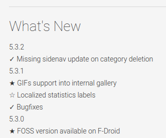

# Play Store Metadata Fetcher V2

This is a complete overhaul of the old [PHP Play Store Metadata Fetcher](https://github.com/federicoiosue/PSMetadataFetcher) project.

Google doesn't provide an API access to easilly retrieve Android application's useful data like for example the actually released version to compare with the one installed on a device and eventually prompt for updates.

A common method to accomplish this task is by providing a service or a web page where to store the app necessary data and then retrieve them directly from the device when needed. But given that Google already provides a portal, as I am lazy, I'd like to try to take advantage of their web infrastructure.

## Usage

1. Upload the project on a hosting or VPS supporting Java 1.8

2. Simply run the JAR built from the project with ``` java -jar PlayStoreMetadataFetcher-0.0.1.jar ```, this will start an embedded Tomcat servlet container listening [https://spring.io/blog/2014/03/07/deploying-spring-boot-applications]

3. Perform a HTTP GET request to targeting the API as follows using as query parameter the Google Play Store's app ID and (optional) the desired language:

   ```http
   [YOUR_HOST]:8080?app-package=it.feio.android.omninotes&lang=it
   ```

4. A json similar to the following will be returned, the language will depend on the request param language:

   ```json
   {
     "datePublished": "18 gennaio 2014", 
     "fileSize": "1,8M", 
     "numDownloads": "500-1.000", 
     "softwareVersion": "4.1.2", 
     "operatingSystems": "2.3 e superiori", 
     "contentRating": "Maturità bassa"
   }
   ```

### Caching

To reduce data overload Play Store's request are locally cached by using app's ID and language as combined key. The ``` CachingConfig.CACHE_TTL_IN_MINUTES ``` value (currently 10 minutes).

### Multiple versions on Play Store

If multiple versions of the app have been released on the Play Store the ``` softwareVersion ``` field could contain just something like "Varies with device".
The workaround used to manage this situation is to create the changelog like the one that follows, by putting the latest released version on top of it.

 

By doing like this the script will automatically parse the version and replace into the returned JSON.